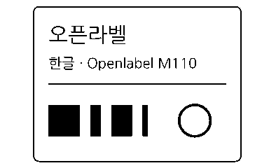

<p align="center">
  
</p>
<h1 align="center">OpenLabel</h1>
<p align="center">AI로 Phomemo 프린터를 제어하세요.</p>
<p align="center">AI 에이전트가 라벨을 미리 보고 인쇄할 수 있는 JSON CLI와 데스크톱 앱.</p>
<p align="center"><a href="https://v2.tauri.app/"></a> <a href="https://react.dev/"></a> <a href="https://www.rust-lang.org/"></a> <a href="https://www.typescriptlang.org/"></a></p>
<p align="center"><a href="README.md">English</a> · <a href="README.ko.md">한국어</a></p>

<p align="center">
  <br>
  <sub>OpenLabel이 생성한 도트 미리보기</sub>
</p>

## 시작하기

Apple Silicon macOS에서 Phomemo M110을 Bluetooth로 연결해 사용합니다.
Node.js 22.12 이상, npm, stable Rust, Xcode Command Line Tools
(`xcode-select --install`)가 필요합니다. 저장소 루트에서 실행합니다.

### AI / CLI

```sh
cargo build --manifest-path src-tauri/Cargo.toml --locked --release --bin openlabel
./src-tauri/target/release/openlabel preview fixtures/sample.svg \
  --output /tmp/openlabel-preview.png --json
```

[OpenLabel 스킬](integrations/codex/openlabel/SKILL.md)을 에이전트에 전달하면 프린터를 찾고, 라벨을 미리 본 뒤 승인받아 인쇄할 수 있습니다.

### 데스크톱 GUI

```sh
npm ci
npm run tauri -- dev
```

이미지를 열고 배치를 조절한 뒤, 최종 라벨을 확인하고 인쇄하세요. 상단에서 English 또는 한국어를 선택할 수 있습니다.

앱 빌드: `npm run tauri -- build --bundles app`.
생성 경로: `src-tauri/target/release/bundle/macos/Openlabel.app`.

## 문서

- [CLI 명령과 에이전트 사용](docs/agent-cli.md)
- [구조와 인쇄 계약](docs/architecture.md)
- [데스크톱 디자인과 상호작용](docs/design-system.md)

[MIT](LICENSE) · Copyright 2026 songhyun-k.
NanumGothic: [SIL OFL 1.1](assets/fonts/OFL.txt) · [글꼴 출처](assets/fonts/PROVENANCE.md).
